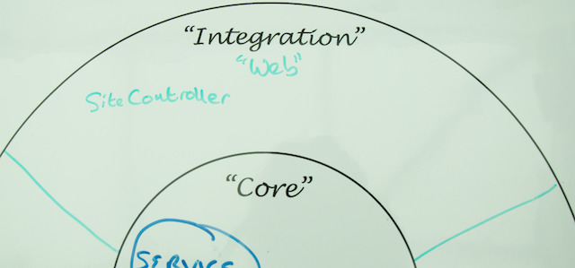

##Step 2: Implementing URLs and returning data

You've decided on your Web domains URLs and captured them on your Life Preserver as the Web domain's components:


It's time to implement your Yummy Noodle Bar Web front end. The first step in building a service with Spring MVC is to construct and test one or more controllers that are responsible for handling each incoming HTTP request as you defined in the previous step.

## Start with a (failing) test

[Test Driven Development (TDD)](http://en.wikipedia.org/wiki/Test-driven_development) teaches us that if you haven't got a failing test then there's no code to write! So before you dive into implementing the service, create a few tests that justify and encourage you to write some code to make the test pass.

### Separate commands from queries

Before you start creating tests, consider the categories of requests that your service will respond to. You are going to be writing tests that look for all the HTTP interactions that you designed in [Step 1](../1/).

These interactions can be split into three categories:

* Requests that read, or query, the Menu
* Requests that update the basket
* Requests that create an Order

You can separate these interactions into two categories:

* Requests that change a resource's state (a Command)
* Requests that query a resource's state (a Query)

It's possible to implement these two categories of interactions using one controller for each resource. However, the [Command Query Responsibility Segregation (CQRS)](http://martinfowler.com/bliki/CQRS.html) pattern advises you to split these responsibilities into different routes through your application. In this tutorial you will implement these concerns separately.

### Testing at the right level

When writing code, you have a choice of what tests to write, and how much to isolate the code you are testing.   The amount of isolation you apply defines the type of test you are writing. There are three major levels, unit, integration and functional.

As spoken about by Mike Cohn and Martin Fowler, these form a [Testing Pyramid](http://martinfowler.com/bliki/TestPyramid.html).

You should write as many tests as is practical at the lower levels of the pyramid, at the unit level, fewer in integration and a minimal amount of tests at the functional level.

### Testing with Spring MockMvc

Spring provides comprehensive support for writing tests at all levels of the pyramid.

You need to write a Spring MVC controller, which will contain a significant number of annotations to define its behaviour.  That behaviour needs to be tested so you can be sure that it works along with the raw Java implementation of the controller.

Spring provides MockMVC as the solution to this testing, and allows you to write what Martin Fowler calls a [Subcutaneous Test]( http://martinfowler.com/bliki/SubcutaneousTest.html), driving the controller in the same way that a full web container would.

## Define the behaviour, create a test

The first URL you will implement is "/".  This is the root of the Yummy Noodle bar web site, and will be referred to as the 'site' url. It will contain a list of the menu items available, allow users to add the menu items to a basket, and provide a mechanism to place the order

The first thing to do, is make the site url available.

First step, you need to create a new, empty class `com.yummynoodlebar.web.controller.SiteController`
This is where you will implement the controller.

Before you can implement that controller though, create a new test `com.yummynoodlebar.web.controller.SiteIntegrationTest`

`src/test/java/com/yummynoodlebar/web/controller/SiteIntegrationTest.java`
```java
package com.yummynoodlebar.web.controller;

import com.yummynoodlebar.core.services.MenuService;
import com.yummynoodlebar.events.menu.RequestAllMenuItemsEvent;
import com.yummynoodlebar.web.controller.fixture.WebDataFixture;
import org.junit.Before;
import org.junit.Test;
import org.mockito.InjectMocks;
import org.mockito.Mock;
import org.mockito.MockitoAnnotations;
import org.springframework.test.web.servlet.MockMvc;

import static org.mockito.Matchers.any;
import static org.mockito.Mockito.when;
import static org.springframework.test.web.servlet.request.MockMvcRequestBuilders.get;
import static org.springframework.test.web.servlet.result.MockMvcResultHandlers.print;
import static org.springframework.test.web.servlet.result.MockMvcResultMatchers.content;
import static org.springframework.test.web.servlet.setup.MockMvcBuilders.standaloneSetup;

public class SiteIntegrationTest {

	private static final String RESPONSE_BODY = "Yummy Noodles,Special Yummy Noodles,Low cal Yummy Noodles";

	MockMvc mockMvc;

	@InjectMocks
	SiteController controller;

	@Mock
	MenuService menuService;

	@Before
	public void setup() {
		MockitoAnnotations.initMocks(this);

		mockMvc = standaloneSetup(controller).build();

		when(menuService.requestAllMenuItems(any(RequestAllMenuItemsEvent.class))).thenReturn(WebDataFixture.allMenuItems());

	}

	@Test
	public void thatTextReturned() throws Exception {
		mockMvc.perform(get("/"))
		.andDo(print())
		.andExpect(content().string(RESPONSE_BODY));

	}

}
```


Run the test with

```sh
$ ./gradlew -Dtest.single=SiteIntegrationTest test
```

The test will fail, and you will see the error

```
:compileJava
:processResources UP-TO-DATE
:classes
:compileTestJava
:processTestResources UP-TO-DATE
:testClasses
:test

com.yummynoodlebar.web.controller.SiteIntegrationTest > thatTextReturned STARTED

com.yummynoodlebar.web.controller.SiteIntegrationTest > thatTextReturned FAILED
    java.lang.AssertionError at SiteIntegrationTest.java:44

1 test completed, 1 failed
:test FAILED

FAILURE: Build failed with an exception.
```

The controller class you created has no implementation or configuration yet, as expected.  You can now safely implement the controller.

## Create a controller and mapping

You are building an interactive, HTML website for a user to use, however the first thing you need to do is get a basic controller returning some text to the user.

As we have described in the test above, you will build a controller that will query for menu items.  For now, the test expects the menu items to be populated into a plain text file, comma delimited.

`src/main/java/com/yummynoodlebar/web/controller/SiteController.java`
```java
package com.yummynoodlebar.web.controller;

import org.slf4j.Logger;
import org.slf4j.LoggerFactory;
import org.springframework.beans.factory.annotation.Autowired;
import org.springframework.stereotype.Controller;
import org.springframework.web.bind.annotation.RequestMapping;
import org.springframework.web.bind.annotation.RequestMethod;
import org.springframework.web.bind.annotation.ResponseBody;

import com.yummynoodlebar.core.services.MenuService;
import com.yummynoodlebar.events.menu.AllMenuItemsEvent;
import com.yummynoodlebar.events.menu.MenuItemDetails;
import com.yummynoodlebar.events.menu.RequestAllMenuItemsEvent;

@Controller
@RequestMapping("/")
public class SiteController {

	private static final Logger LOG = LoggerFactory.getLogger(SiteController.class);

	@Autowired
	private MenuService menuService;

	@RequestMapping(method = RequestMethod.GET)
	@ResponseBody
	public String getCurrentMenu() {
		LOG.debug("Yummy Menu directly to ResponseBody");
		return prettyPrint(menuService.requestAllMenuItems(new RequestAllMenuItemsEvent()));
	}

	private String prettyPrint(AllMenuItemsEvent requestAllMenuItems) {
		StringBuffer sb = new StringBuffer();
		String delim = "";
		for (MenuItemDetails menuItemDetails : requestAllMenuItems.getMenuItemDetails()) {
			sb.append(delim).append(menuItemDetails.getName());
			delim = ",";
		}

		return sb.toString();
	}

}
```

Again, run the test with:

```sh
./gradlew -Dtest.single=SiteIntegrationTest test
```

The test will now pass, and you will see:

```
:compileJava
:processResources
:classes
:compileTestJava
:processTestResources UP-TO-DATE
:testClasses
:test

com.yummynoodlebar.web.controller.SiteIntegrationTest > thatTextReturned STARTED

com.yummynoodlebar.web.controller.SiteIntegrationTest > thatTextReturned PASSED

BUILD SUCCESSFUL
```

The controller is correctly returning Menu from a service and transforming it into text.

## Summary

Congratulations! You've created a controller that implements a portion of your Website. You've tested that controller using 'MockMVC' outside of a container to confirm that the handler mappings work.

Your Life Preserver now contains a new component, the SiteController, in the Web domain:



The full view of your current Life Preserver should look like the following:


[Next… Wiring Up and Deploying your Service](../3/)
