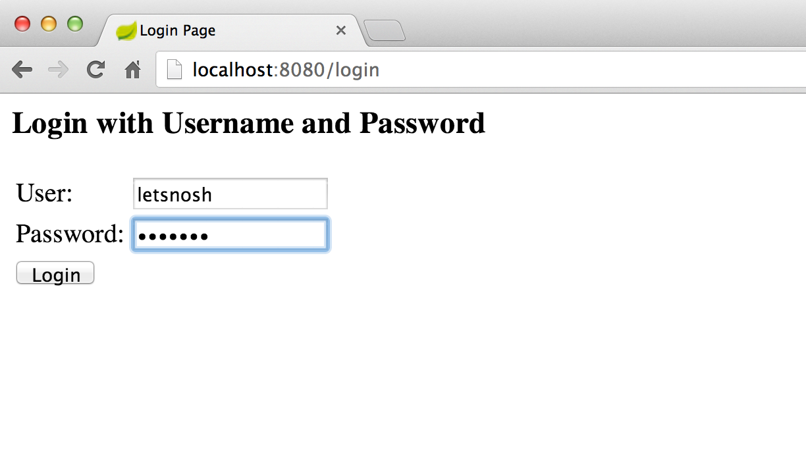
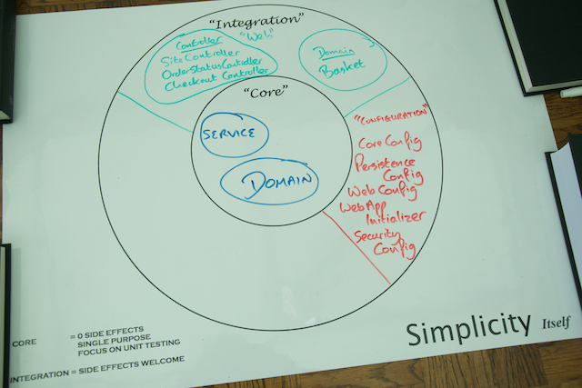

You've set up functionality for the Yummy Noodle Bar Web front end and your Life Preserver is looking great at this point:


The problem is, at this point the Yummy Noodle Bar Web site is a little *too* functional; Orders need to be recorded against users, and only the user that placed an Order should be able to view and manage it.

## Step 6: Securing the Web Application

Once again, all changes here are constrained to the Configuration domain:


### Authentication on the Web

To limit access to the Yummy Noodle Bar Web font end, you extend the initial web design as follows:

* URLs that need to have a known user will be protected, and if no user authentication is present, will issue a 302 to the login form.
* A security token will be placed in the HTTP Session in the web container.
* The session will be loaded on every request against the JSESSIONID cookie that is placed in the users browser by a response cookie.

Spring Security helps you perform these steps without you having to change so much as a single controller!

#### Add Spring Security to your project

First you add Spring Security dependencies to the project, by adding the following entries to your `build.gradle` script:

`build.gradle`
```gradle
repositories {
  mavenCentral()

  maven { url 'http://repo.springsource.org/milestone/'}
}
```

`build.gradle`
```gradle
  compile 'org.springframework.security:spring-security-web:3.2.0.M2'
  compile 'org.springframework.security:spring-security-core:3.2.0.M2'
  compile 'org.springframework.security:spring-security-config:3.2.0.M2'
```

You add the Pivotal milestone repository so that you can use Spring Security 3.2.0.M2. This lets you use some dynamic configuration features of Spring Security, including setting up the web security through JavaConfig.

Now you need to secure your controllers. Until now you've been writing tests first before making any code changes, including configuration. So, instead of immediately adding your security configuration, you'll create a test so that you'll know when your security is being applied correctly.


#### Configure Spring Security

You can now add a new concern to your application: security configuration. Create a new Spring configuration in com.yummynoodlebar.config named `SecurityConfig` that contains the following:

`src/main/java/com/yummynoodlebar/config/SecurityConfig.java`
```java
package com.yummynoodlebar.config;

import org.springframework.context.annotation.Bean;
import org.springframework.context.annotation.Configuration;
import org.springframework.security.authentication.AuthenticationManager;
import org.springframework.security.config.annotation.authentication.builders.AuthenticationManagerBuilder;
import org.springframework.security.config.annotation.method.configuration.EnableGlobalMethodSecurity;
import org.springframework.security.config.annotation.web.builders.HttpSecurity;
import org.springframework.security.config.annotation.web.configuration.EnableWebSecurity;
import org.springframework.security.config.annotation.web.configuration.WebSecurityConfigurerAdapter;

@EnableWebSecurity
@Configuration
@EnableGlobalMethodSecurity(prePostEnabled=true)
public class SecurityConfig extends WebSecurityConfigurerAdapter {

  @Override
  protected void registerAuthentication(AuthenticationManagerBuilder auth) throws Exception {
    auth.inMemoryAuthentication()
        .withUser("letsnosh").password("noshing").roles("USER");
  }

  @Override
  protected void configure(HttpSecurity http) throws Exception {
    http.authorizeUrls()
        .antMatchers("/order/**").hasRole("USER")
        .antMatchers("/checkout").hasRole("USER")
        .anyRequest().anonymous()
        .and()
        //This will generate a login form if none is supplied.
        .formLogin();
  }

  @Bean
  @Override
  public AuthenticationManager authenticationManagerBean() throws Exception {
       return super.authenticationManagerBean();
  }
}
```

This configuration enables security using the `@EnableWebSecurity` annotation, and extends the `WebSecurityConfigurerAdapter` so that you can perform more detailed configuration of the web security you're applying.

The `registerAuthentication` method is overridden from `WebSecurityConfigurerAdapter` in order to configure an in-memory database of users, their passwords and associated roles.

The `configure`, overridden method from `WebSecurityConfigurerAdapter`, method provides a fine grained fluent API for controlling how the security system will be applied.

`src/main/java/com/yummynoodlebar/config/SecurityConfig.java`
```java
    http.authorizeUrls()
        .antMatchers("/order/**").hasRole("USER")
        .antMatchers("/checkout").hasRole("USER")
        .anyRequest().anonymous()
        .and()
        //This will generate a login form if none is supplied.
        .formLogin();
```

Here, you've configured URL level protection using the `http.authorizeUrls()` method. The `http.authorizeUrls()` method protects the /checkout and /order/* urls, ensuring that only users with the USER role can access them.

This will force users to log in before checking out, and ensure that only logged in users can view orders.  The `formLogin()` method call instructs Spring Security that users will login via an HTML form.  We give no further information on how this will work, and so Spring Security will generate a new HTML form and URL for you available on `/login`.


### Configure the Spring Security filter chain

Spring Security relies on a Servlet filter to apply your security configuration. A filter is used so that security is applied before the Spring MVC Dispatcher Servlet gets involved in processing incoming requests. The Spring Security filter is referred to as the Spring Security filter chain, as it actually delegates to a chain of filters internally that each apply one aspect of the security responsibility.

You now need to configure this filter chain by updating the web application configuration you created earlier. In the previous section, you configured things in the `WebAppInitializer` class.

The first step is to simply add your new `SecurityConfig` JavaConfig class to the root context

`src/main/java/com/yummynoodlebar/config/WebAppInitializer.java`
```java
	@Override
	protected Class<?>[] getRootConfigClasses() {
		return new Class<?>[] { SecurityConfig.class, PersistenceConfig.class, CoreConfig.class };
	}
```

Next, Spring Security needs to be inserted into the web context setup.   This could be done in `WebAppInitializer`, however a better option in this case is to add a second web app initializer class specifically for the security setup.

`src/main/java/com/yummynoodlebar/config/SecurityWebAppInitializer.java`
```java
package com.yummynoodlebar.config;

import org.springframework.core.annotation.Order;
import org.springframework.security.web.context.AbstractSecurityWebApplicationInitializer;

@Order(1)
public class SecurityWebAppInitializer
    extends AbstractSecurityWebApplicationInitializer { }
```

This configures the Spring Security filter chain and manages inserting it into the web context.

It is important that the Spring Security setup is done before the DispatcherServlet configuration in `WebAppInitializer`.  The `@Order` annotation from Spring Core can be used to manage the order of execution.

The full classes now look like

`src/main/java/com/yummynoodlebar/config/SecurityWebAppInitializer.java`
```java
package com.yummynoodlebar.config;

import org.springframework.core.annotation.Order;
import org.springframework.security.web.context.AbstractSecurityWebApplicationInitializer;

@Order(1)
public class SecurityWebAppInitializer
    extends AbstractSecurityWebApplicationInitializer { }
```

`src/main/java/com/yummynoodlebar/config/WebAppInitializer.java`
```java
package com.yummynoodlebar.config;

import javax.servlet.Filter;

import org.springframework.core.annotation.Order;
import org.springframework.web.filter.CharacterEncodingFilter;
import org.springframework.web.servlet.support.AbstractAnnotationConfigDispatcherServletInitializer;

@Order(2)
public class WebAppInitializer extends
		AbstractAnnotationConfigDispatcherServletInitializer {

	@Override
	protected Class<?>[] getRootConfigClasses() {
		return new Class<?>[] { SecurityConfig.class, PersistenceConfig.class, CoreConfig.class };
	}

	@Override
	protected Class<?>[] getServletConfigClasses() {
		return new Class<?>[] { WebConfig.class };
	}

	@Override
	protected String[] getServletMappings() {
		return new String[] { "/" };
	}

	@Override
	protected Filter[] getServletFilters() {

		CharacterEncodingFilter characterEncodingFilter = new CharacterEncodingFilter();
		characterEncodingFilter.setEncoding("UTF-8");
		return new Filter[] { characterEncodingFilter};
	}

}
```

### Pulling it together

Run the application.

```sh
$ ./gradlew tomcatRunWar
```

When you visit [http://localhost:8080/](http://localhost:8080) you will be able to see the available menu and add items to your basket, as before.  However now, if you click checkout on the basket screen and visit [http://localhost:8080/checkout](http://localhost:8080/checkout), you will instead be redirected to a login screen and forced to log in before being able to proceed.



Enter the user name and password you configured in `SecurityConfig`: user `letsnosh` and password `noshing`.  You will then be taken to the checkout page, as before.  This time, however, you are logged in.

> **Note:** You may notice that the theme of Yummy Noodle Bar is missing on the login page. It's possible to use a custom login page, for purposes of brevity, this tutorial using Spring Security's default login page.

## Summary

You have secured your application using Spring Security, and Yummy Noodle Bar is getting excited!

See the current state of your application in the following Life Preserver diagram:



Well done!  You have completed the adding of a Web front end to the Yummy Noodle Bar.

[Next.. Summary and Recap](../7/)
